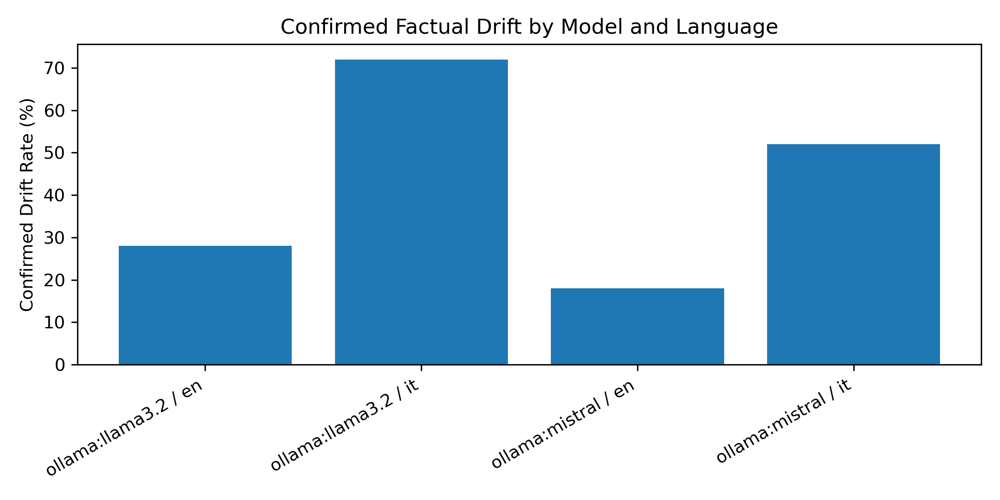
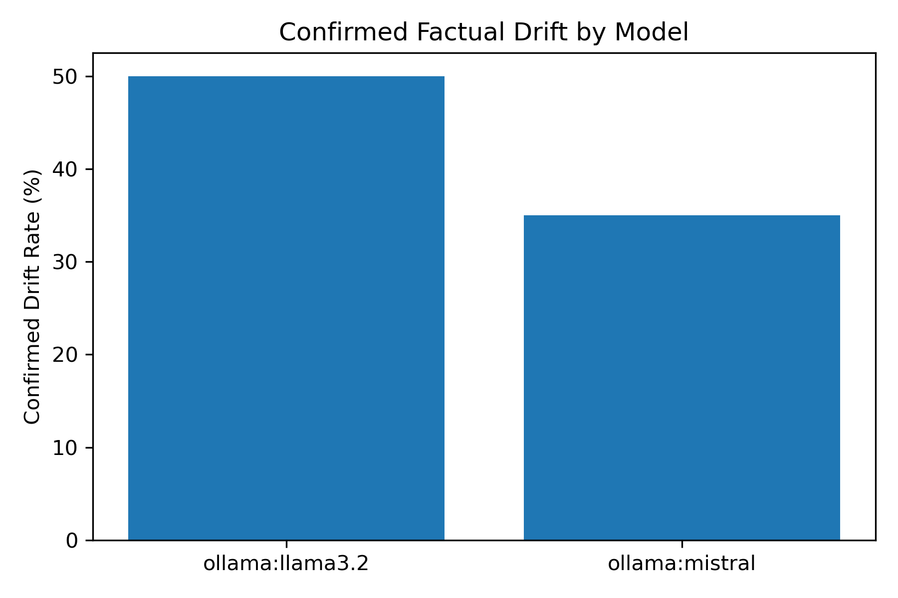
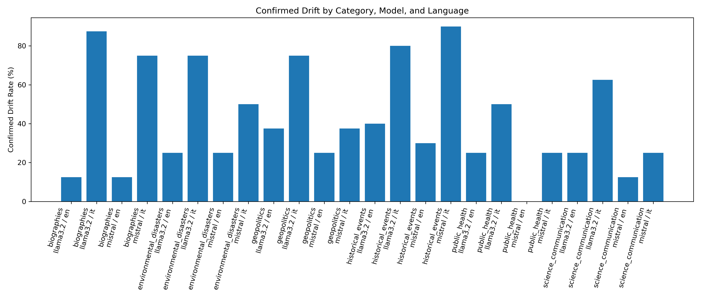

# Cross-Lingual Factuality Drift Benchmark

### Interactive Dashboard

🔗 **[Open Streamlit Dashboard](https://cross-lingual-factuality-drift-7t8f8rcjwulous7ldrrcfb.streamlit.app/)**

Benchmark evaluating cross-lingual factual consistency across English and Italian prompts in local language models.

The project investigates whether factual accuracy changes across languages, combining automated evaluation pipelines with full manual adjudication.

Models evaluated:

- llama3.2 (Ollama)
- mistral (Ollama)

Scope:

- 200 manually reviewed outputs
- English + Italian
- Cross-lingual factual consistency
- Full manual evaluation workflow

## Motivation

Cross-lingual robustness remains an important challenge for language models.

Models may preserve factual accuracy in one language while introducing factual distortions, omissions, or unsupported additions in another.

This benchmark evaluates whether factual reliability remains stable across English and Italian prompts.

## Methodology

Pipeline:

Prompt generation
→ Ollama inference
→ Annotation pipeline
→ Initial candidate detection heuristics
→ Full manual adjudication (200 outputs)
→ SQL analysis (DuckDB)
→ Visualization generation
→ Streamlit dashboard

## Benchmark Categories

- Historical events
- Biographies
- Geopolitics
- Environmental disasters
- Public health
- Science communication

## Models

| Model | Runtime |
|--------|----------|
| llama3.2 | Ollama |
| mistral | Ollama |

## Dashboard

Interactive Streamlit dashboard for benchmark exploration.

## Key Findings

- Both evaluated local models showed substantially elevated confirmed factual drift rates in Italian compared to English.

- Llama 3.2 demonstrated stronger cross-lingual degradation overall (28% EN → 72% IT).

- Mistral also exhibited Italian vulnerability (18% EN → 52% IT).

- Historical events emerged as the highest-risk category for confirmed cross-lingual factual drift.

- Biographies and environmental disasters also showed elevated cross-lingual drift.

## Visualizations

### Confirmed Drift by Model

### Drift by Language

### Drift by Category + Language

## Tech Stack

- Python
- Pandas
- DuckDB
- SQL
- Promptfoo
- Ollama
- Streamlit
- Matplotlib

## Future Improvements

- Additional languages
- Additional local models
- Expanded factual categories
- Automated drift detection improvements